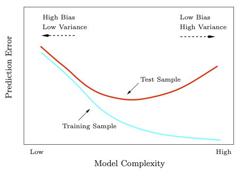
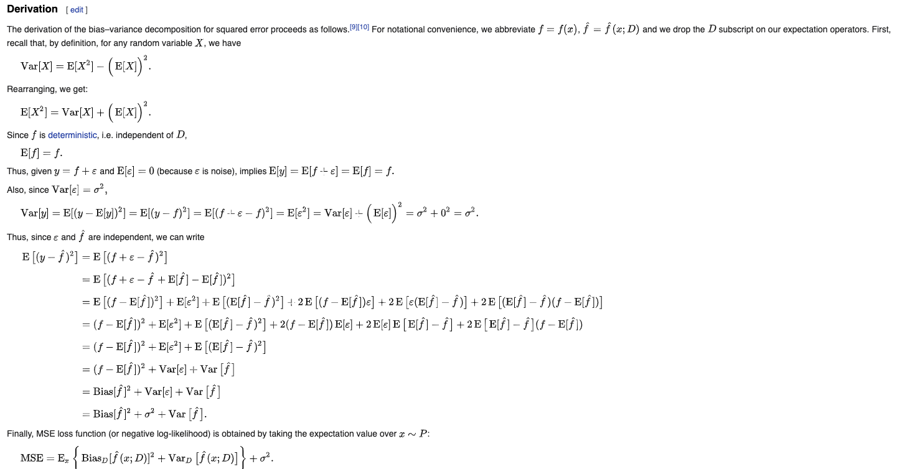

\newcommand{\bX}{\mathbf{X}}
\newcommand{\bY}{\mathbf{Y}}
\newcommand{\bx}{\mathbf{x}}
\newcommand{\by}{\mathbf{y}}

## 0. Notations

* Use upper case letters $X,Y,G$ for generic variables

  + Input variable $X$ with $j$th component denoted as $X_j$

  + Quantitative output $Y$

  + Qualitative output $G$

* Observed values in lowercase

  + $i$th observation of $X$ is $x_i$ (a scalar or a vector)
  
* Matrices are represented in bold uppercase letters
  
  + A set of $N$ input $p$-vectors $x_i$, $i = 1...N$ will be $\bX \in \mathbb{R}^{N\times p}$
  
  + $p$-vector of input $x_i$ for the $i$th observation v.s. the $N$-vector $\bx_j$ for all the observations on variable $X_j$
  
  * All vectors are assumed to be column vectors, the $i$th row of $\bX$ is $x_i^T$.


## 1. Types of variables

* Qualitative variables, factors, categorical or discrete variables $\rightarrow$ __Classification__

* Quantitative measurements $\rightarrow$ __Regression__

* Ordered qualitative variables

## 2. Two simple approaches to prediction: least squares and nearst neighbors

### 2.1 Linear models and least squares

* Linear model

 + Input: $X^T = (X_1, X_2, ..., X_p)$, Outcome: $Y$

 + Model: $\hat{Y} = \hat{\beta}_0 + \sum_{j= 1}^pX_j\hat{\beta}_j$ or $\hat{Y} = X^T\hat{\beta}$
 
 
* Least Square

 + To minimize $\text{RSS}(\beta) = \sum_{i = 1}^N (y_i - x_i^T\beta)^2$ or $\text{RSS}(\beta) = (\by - \bX\beta)^T(\by - \bX\beta)$
 
 + Differentiate w.r.t. $\beta$ gives $\bX^T(\by - \bX\beta) = 0$
 
 + Solves to $\hat{\beta} = (\bX^T\bX)^{-1}\bX^T\by$
 
 + Fitted value at the $i$th input $x_i$ is $\hat{y}_i = x_i^T\hat{\beta}$

### 2.2 Nearest neighbor methods

The $k$-nearest neighbor fit for $\hat{Y}$: $\hat{Y}(x) = \frac{1}{k}\sum_{x_i \in N_k(x)}y_i$, where $N_k(x)$ is the neighborhood of $x$ as the $k$ closest points $x_i$ in the training set. 

For $k$-nearest neighbor fit, the error on the training data should be approximately an increasing function of $k$, and 0 for $k = 1$. We cannot use sum of squared errors as training criterion for picking $k$. 

There is only one parameter in the fit, which is $k$. But the effective number of parameters is $N/k$, because there would be $N/k$ neighbors and we need that many means for each of the neighborhood.


### 2.3 From least square to nearst neighbors

Least square: smooth linear decision boundary and stable to fit, but heavily rely on assumption of linear decision boundary. __Low variance but high bias__.

$knn$: no strong assumption and can adapt to any situation, but unstable (depend on a handful of input points and their positions). __High variance but low bias__.

## 3 Statistical decision theory

_[1.] Quantitative output_ framework:

* Output $Y \in \mathbb{R}$, and input$X\in \mathbb{R}^p$ 

* Joint distribution $\text{Pr}(X,Y)$

* Goal: find a function $f(X)$ to predict $Y$. 

* Loss $L(Y, f(X))$, e.g. a squared error loss $L(Y,f(X))$

The expected squared prediction value is

$$\begin{aligned}
EPE(f) &= E(Y -f(X))^2 \\
& = E_XE_{Y|X}([Y-f(X)]^2|X) \quad \text{conditioning on X}
\end{aligned}$$

which can be minimized by $f(x) = \text{argmin}_cE_{Y|X}([Y-c]^2|X)$, which can be solved by $f(x) = E(Y|X = x)$, also known as the regression function. __The best prediction of $Y$ at any point $X = x$ is the conditional mean when best is measured by average squared error__.

$knn$ mimics this framework, by $\hat{f}(x) = \text{Ave}(y_i|x_i \in N_k(x))$ with two approximations 

* expectation is approximated by averaging over sample data;

* conditioning at a point is relaxed to conditioning on some region close to the target point

Least square also mimics this framework, with the assumption that the regression function $f(x)$ is approximately linear in its argument, i.e. $f(x) \approx x^T\beta$. Therefore, $\beta$ can be solved by $\beta = [E(XX^T)]^{-1}E(XY)$. That is not to condition on X, rather we used our knowlege of the functional relationship to pool over values of X. Least square estimates replace $E(\cdot)$ by averaging over the training data. 


_[2.] Qualitative output_ framework:

* Suppose there are $K$ classes in $G$.

* Loss function can be represented by a $K \times K$ matrix $\mathbf{L}$, where each position $L(k,l)$ is the loss for misclassifying $G_k$ as $G_l$. Most commonly we can use the zero_one loss, that is the set the the loss as 1. 

The expected prediction error is 

$$\begin{aligned}
\text{EPE} &= E[L(G,\hat{G}(X))]\\
&= E_X \sum_{k = 1}^{K}L[G_k, \hat{G}(X)]Pr(G_k|X)
\end{aligned}
$$

which can be minimized by 

$$\begin{aligned}
\hat{G}(x) &= \text{argmin}_{g\in G}\sum_{k = 1}^{K}L[G_k, g]Pr(G_k|X = x)\\
&= \text{argmin}_{g\in G}[1-Pr(g|X = x)]\\
&= \text{max}_{}Pr(g|X = x)
\end{aligned}
$$

This is known as the _Bayes Classifier_, such that we classify to the most probably class, using the conditional distribution $Pr(G|X)$. 


$knn$ directly approximates this solution using majority vote in a nearest neighborhood, except that conditional probability at a point is relaxed to conditional probability within a neighborhood of a point and probability are approximated by training sample proportions. 

## 4. Function approximation

Data $\{x_i,y_i\}$ are considered to be from a $p+1$ dimensional Euclidean space. The function $f(x)$ has domain equal to a $p$-dimensional subspace. Data and function are related via the model $y_i = f(x_i) + \epsilon_i$.  The goal for learning is to find an approximation to $f(x)$ in $\mathbb{R}^p$ given the representation in the domain of data which is $\mathbb{R}^{p+1}$

The question is to find a set of parameters $\theta$ for the function $f_\theta(x)$ with following criterion

_[1.] Least square_

To minimize the $\text{RSS}(\theta) = \sum_{i= 1}^N(y_i - f_\theta(x_i))^2$

_[2.] Maximum likelihood estimation_

If we have a random sample $y_i$, $i = 1...N$ from a density $Pr_\theta(y)$. The log-probability of the observed sample is $L(\theta) = \sum_i \log Pr_\theta(y_i)$. The most reasonable values for $\theta$ are those for which the probability of the observed sample is the largest. 

## 5. Restricted estimators

Minimizing the RSS leads to many solution, because any function $\hat{f}$ that passing through the training points is a solution. Therefore, we need to add complexity restrictions, that is, for all input points $x$ sufficiently close to each other in some metirc, $\hat{f}$ exhibits osme specical structure such as nearly constant, linear, or low-order polynomial behavior. 

### 5.1 Roughness penalty and Baysian methods

$$\text{PRSS}(f;\lambda) = \text{RSS}(f) + \lambda J(f)$$
with penalty $J(\cdot)$. E.g. cubic smoothing splines penalizes on large values of second order derivative. 

### 5.2 Kernal methods and local regression

Kernel methods control the nature of the local neighborhood, using a kernel function $K_\lambda(x_0,x)$, which put weights to points $x$ in a region near $x_0$ ($\lambda$ controls the width of the neighborhood). 

A local regression estimate of $f(x_0)$ as $f_{\hat{\theta}}(x_0)$ where $\hat{\theta}$ minimizes $\text{RSS}(f_\theta,0) = \sum_i K_\lambda (x_0,x_i)(y_i - f_\theta(x_i))^2$.

### 5.3 Basis functions and dictionary methods

$$f_\theta(x) = \sum_{m = 1}^M \theta_m h_m(x)$$

## 6. Model selection and the Bias-variance tradeoff

```{r, out.width="0.5\\linewidth", include=TRUE, fig.align="center", fig.cap=c("Model Complexity v.s. Prediction Errors"), echo=FALSE}

```

Data $\{x_i,y_i\}$, model $y = f(x) + \epsilon$, where $E(\epsilon) = 0$, $var(\epsilon) = \sigma^2$
$$E[(y - \hat{f}(x))^2] = (\text{Bias}[\hat{f}(x)])^2 + Var[\hat{f}(x)] + \sigma^2$$
* $\text{Bias}[\hat{f}(x)] = E[\hat{f}(x)] - f(x)$: error caused by simplifying assumptions build into the method

* $Var[\hat{f}(x)] = E[(E[\hat{f}(x)]-\hat{f}(x))^2]$: variance of the learning method
 
* irreducible error $\sigma^2$ due to the new test target. 

Derivation

```{r, out.width="1.2\\linewidth", include=TRUE, fig.align="center", fig.cap=c("Bias-Variance Tradeoff"), echo=FALSE}

```


