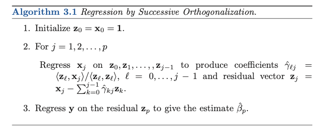
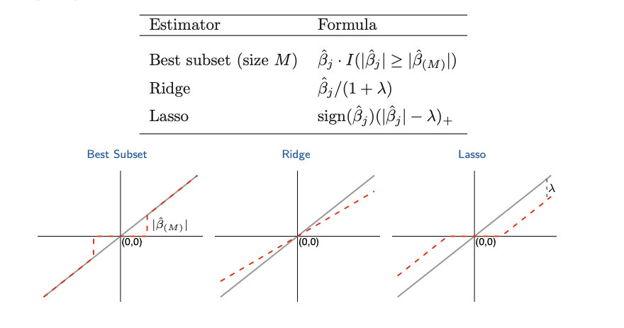
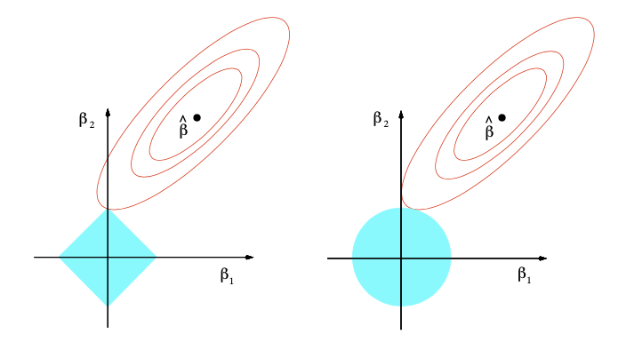
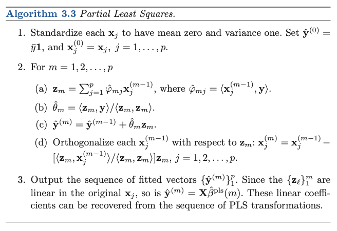

\newcommand{\bX}{\mathbf{X}}
\newcommand{\bY}{\mathbf{Y}}
\newcommand{\bx}{\mathbf{x}}
\newcommand{\by}{\mathbf{y}}

## 1. Introduction

Linear regression assumes that the regression function $E(Y|X)$ is linear in the inputs $X_1,\dots,X_p$. 

## 2. Linear regression models and least square

[1.] _Linear regression from a least square point of view_ (minimal assumption about the distribution)

* Form:  $f(X) = \beta_0 + \sum_{j = 1}^p X_j\beta_j$

* Data: $\{x_i,y_i\}\quad i = 1...N$, each $x_i = (x_{i1}...x_{ip})^T$ is a feature vector, with parameters $\beta = (\beta_0,\beta_1, ..., \beta_p)^T$

* Least square: To minimize $\text{RSS}(\beta) = \sum_{i= 1}^N (y_i - f(x_i))^2 = \sum_{i = 1}^N (y_i - \beta_0 -\sum_{j=1}^p x_{ij}\beta_j)^2$ or $\text{RSS}(\beta) = (\mathbf{y}-\mathbf{X}\beta)^T(\mathbf{y}-\mathbf{X}\beta)$ in matrix form. __LSE makes no assumptions about the validity of the model form__

* LSE: $\hat{\beta} = (\bX^T\bX)^{-1}\bX^T\by$

* Fitted value: $\hat{\by}=\bX(\bX^T\bX)^{-1}\bX^T\bY$. $\mathbf{H} = \bX(\bX^T\bX)^{-1}\bX$ is the projector of $\by$ onto the subspace spanned by column space of $\bX$. 

* Inference on parameters (assuming $y_i$'s are uncorrelated and gave constant variance $\sigma^2$, and $x_i$ are fixed)
  
  - $Var(\hat{\beta}) = (\bX^T\bX)^{-1}\sigma^2$
  - $\hat{\sigma}^2 = \frac{1}{N-p-1}\sum_{i=1}^{N}(y_i - \hat{y}_i)^2$
  
[2.] _Linear regression with Gaussian error_

* Model Assumption: $Y = \beta_0 + \sum_{j=1}^pX_j\beta_j + \epsilon$, where $\epsilon\sim N(0, \sigma^2)$

* Distributional properties of model parameters 
  
  - $\hat{\beta} \sim N(\beta, (\bX^T\bX)^{-1}\sigma^2)$
  - $(N-p-1)\hat{\sigma}^2 \sim \sigma^2 \chi_{N-p-1}^2$
  - $\hat{\beta}$ and $\hat{\sigma}^2$ are statistically independent. 
  
* Inference on single parameter $\beta_j$

Under $H_o: \beta_j = 0$, $z_j = \frac{\hat{\beta}_k}{\hat{\sigma}\sqrt{(\bX^T\bX)^{-1}_{ii}}} \sim t_{N-p-1}$, and $\beta_j$ has a $1-2\alpha$ confidence interval of $(\hat{\beta}_j - z^{1-\alpha}\hat{\sigma}\sqrt{(\bX^T\bX)^{-1}_{ii}},\hat{\beta}_j + z^{1-\alpha}\hat{\sigma}\sqrt{(\bX^T\bX)^{-1}_{ii}})$

* Nested Model Comparison (test whether the added variables are necessary to the model)

$$F = \frac{(\text{RSS}_0 - \text{RSS}_1)/(p_1 - p_0)}{\text{RSS}_1/(N-p_1-1)}\sim F_{p_1-p_0,N-p_1-1}, \quad \text{where RSS}_1\text{ is for the larger model}$$

### 2.1 The Gauss-Markow Theorem

__Least square estimates of $\beta$ have the smallest variance among all linear unbiased estimates__.

The least square estimator to estimate parameters $\theta = \alpha^T\beta$ is $\hat{\theta} = \alpha^T(\bX^T\bX)^{-1}\bX^T\by$. It is an unbiased estimator, i.e. $E(\alpha^T\hat{\beta}) = \alpha^T\beta$. Gauss-Markow theorem states that $Var(\alpha\hat{\beta})$ has the smallest variance for any unbiased estimator.

We may want to trade a little bias for larger reduction in variance. 

### 2.2 Regression by succesive orthogonolization

```{r, out.width="0.9\\linewidth", include=TRUE, fig.align="center", fig.cap=c("Gram-Schmidt procedure for multiple regression"), echo=FALSE}

```

### 2.3 Multiple outcomes

Data: $Y_1...Y_K$, with the model $Y_k = \beta_{0k} + \sum_{j=1}^pX_j\beta_{jk}+\epsilon_k$, with the matrix form $\bY = \bX\mathbf{B} + \mathbf{E}$, where $\bY$ is $N\times K$, $\bX$ is $N\times p+1$, and $\mathbf{B}$ us $(p+1)\times K$. 

$\text{RSS}(\mathbf{B}) = \sum_k\sum_i (y_{ik} - f_k(x_i))^2 = \text{tr}(\bY - \bX\mathbf{B})^T(\bY - \bX\mathbf{B})$ is the RSs with LSE $\hat{\mathbf{B}}=(\bX^T\bX)^{-1}\bX^T\bY$

## 3. Subset selection

a. Best subset selection

b. Forward and backward selection


## 4. Shrinkage methods

### 4.1 Ridge regression

* RSS 

$$\hat{\beta}^{\text{ridge}} = \text{argmin}_{\beta}\{{\sum_{i = 1}^N (y_i - \beta_0 \sum_{j = 1}^p x_{ij}\beta_j)^2 + \lambda\sum_{j = 1}^p}\beta_j^2\}$$

or in the matrix form

$$\text{RSS}(\lambda) = (\by - \bX \beta)^T (\by- \bX\beta) + \lambda\beta^T\beta$$ 

with the solution

$$\hat{\beta}^{\text{ridge}} = (\bX^T\bX + \lambda \mathbf{I})^{-1}\bX^T\by$$
Even if $\bX^T\bX$ is not of full rank,  $(\bX^T\bX + \lambda \mathbf{I})$ is still nonsingular.

* Degree of freedom $\text{df}(\lambda) = \text{tr}[\bX(\bX^T\bX + \lambda \mathbf{I})^{-1}\bX^T] = \sum_{j = 1}^p\frac{d_j^2}{d_j^2 +\lambda}$

* Ridge solutions are not equivariant under scaling of the inputs, and one normally standardizes the inputs before solving for estimation.


### 4.2 Lasso

* RSS

$$\hat{\beta}^{\text{lasso}} = \text{argmin}_{\beta}\{{\sum_{i = 1}^N (y_i - \beta_0 \sum_{j = 1}^p x_{ij}\beta_j)^2 + \lambda\sum_{j = 1}^p}|\beta_j|\}$$
* Shrinkage $s = t/\sum_j|\hat{\beta}_j|$ where $\hat{\beta}_j$ is the least square estimation. 

### 4.3 Subset selection,ridge, and lasso

[1.] _Orthonormal input matrix $\bX$_

```{r, out.width="0.9\\linewidth", include=TRUE, fig.align="center", fig.cap=c("Gram-Schmidt procedure for multiple regression"), echo=FALSE}

```

* Ridge: proportional shrinkage

* LASSO: translate by a constant factor and truncating at zero, i.e soft thresholding

* Best subject: drops all the variables with coefficient smaller than the $M$th largest, i.e. hard thresholding

[2.] _Nonorthogonal case_

```{r, out.width="0.9\\linewidth", include=TRUE, fig.align="center", fig.cap=c("Gram-Schmidt procedure for multiple regression"), echo=FALSE}

```

Elastic net

$$\lambda\sum_{j = 1}^p(\alpha \beta^2_j + (1-\alpha)|\beta_j|)$$

### 4.4 Least angle regression

## 5. Methods using derived input directions

### 5.1 Principal components regression

PC regression forms the derived input columns $\mathbf{z}_m = \bX v_m$ and then regresses $\by$ on $\mathbf{z}_1,\mathbf{z}_2,..., \mathbf{z}_M$. Since they are orthogonal, each parameter is simply $\hat{\theta}_n = \frac{<\mathbf{z}_m,\by>}{<\mathbf{z}_m,\mathbf{z}_m>}$. It can be converted back to $\hat{\beta}^{pcr}_M = \sum_{m=1}^{M}\hat{\theta}_mv_m$. 

The $m$th principal component direction $v_m$ solveS:

$$\begin{aligned}
&\text{max}_\alpha \text{Var}(\bX\alpha)\\
& \text{subject to } ||\alpha| = 1, \alpha^T\mathbf{S}v_l = 0, \quad l = 1,...n-1
\end{aligned}
$$
where $\mathbf{S}$ is the sample covariance

### 5.2 Partial least square

```{r, out.width="0.9\\linewidth", include=TRUE, fig.align="center", fig.cap=c("Gram-Schmidt procedure for multiple regression"), echo=FALSE}

```

The $m$th PLS direction $\hat{\psi}_m$ solves:

$$\begin{aligned}
&\text{max}_{\alpha} \text{Corr}^2 (\by, \bX\alpha)\text{Var}(\bX\alpha)\\
&\text{subject to }||\alpha| = 1, \alpha^T\mathbf{S}\hat{\psi}_l = 0, \quad l = 1,...n-1
\end{aligned}
$$