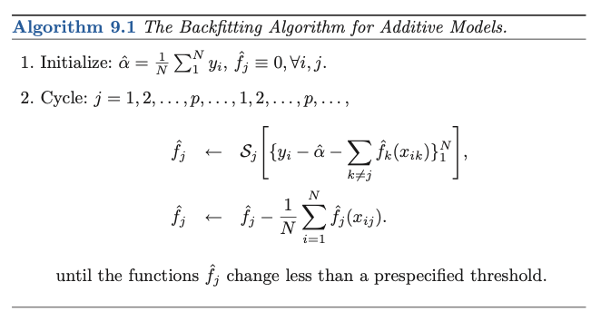
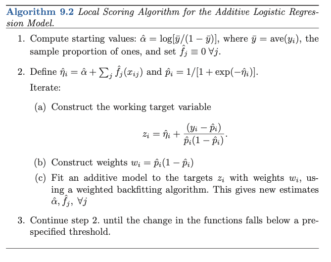
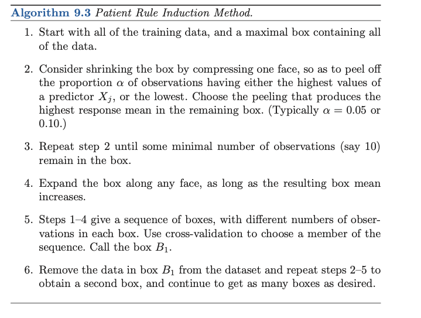

## 1. Generalized Additive Model

Definition

$$E(Y|X_1,...X_p) = \alpha + f_1(X_1) + f_2(X_2)+ \cdots f_p(X_p)$$
where $X_k$ are predictors, and $f_k(\cdot)$ are nonparametrics smooth functions. 

### 1.1 Fitting Additive Models

In order to get unique solution, the standard convention is to assume that $\sum_{i=1}^Nf_j(x_{ij}) = 0\quad \forall j$. The $\hat{\alpha} = \text{ave}(y_i)$. 

```{r, out.width="0.9\\linewidth", include=TRUE, fig.align="center", fig.cap=c("The Backfitting Algorithm for Additive Models"), echo=FALSE}

```


### 1.2 Additive Logistic Regression

```{r, out.width="0.9\\linewidth", include=TRUE, fig.align="center", fig.cap=c("Local Scoring Algorithm for the Additive Logistic Regression Model"), echo=FALSE}

```

## 2. Tree-Based Methods

### 2.1 Background

Recursive binary partitions

### 2.2 Regression Trees

Data $(x_i,y_i)$ with $i = 1...N$, and $x_i = c(x_{i1}...x_{ip})$, i.e. $p$ features. 

Suppose we have a partition into $M$ regions, the response can be modeled as a constant $c_m$ in each region, $f(x) = \sum_{m=1}^M c_mI(x\in R_m)$. LSE gives $\hat{c}_m = \text{ave}(y_i |x_i \in R_m)$. 

We can use a greedy algorithm to start with all of the data, consider a splitting variable $j$ and split point $s$, and find the optimal variable $j$ and $s$. 

_Cost Complexity Pruning_: To grow a large tree $T_0$ and stop when a minimum node size is reached. For any tree $T$ which is a subtree of $T_0$, the cost complexity function is 

$$C_\alpha (T) = \sum_{m=1}^{|T|}N_m Q_m(T)+\alpha|T|$$

where $N_m$ is number of observations falling into terminal node variable, $Q_m()$ is the variance, and $\alpha$ is a tuning parameter, which controls the tree size and goodness of fit. 

### 2.3 Classification Tree

In a mode $m$ representing a region $R_m$ with $N_m$ observations, let $\hat{p}_{mk} = \frac{1}{N_m}\sum_{x_i \in R_m}I(y_i = k)$ be the proportion of class $k$ observations in node $m$. We classify the observations in node $m$ to class $k(m) = \text{argmax}_k \hat{p}_{mk}$, i.e. the majority class in node $m$.  Measures of node impurity include 
 
* Misclassification error: $1 - \hat{p}_{mk(m)}$

* Gini index: $\sum_{k=1}^K \hat{p}_{mk}(1-\hat{p}_{mk})$

* Cross entropy or deviance: $-\sum_{k=1}^K \hat{p}_{mk}\log \hat{p}_{mk}$

Gini and CE are more sensitive to changes in the node probabilities than error rate, so should be used. 

### 2.4 Practical Issues

* The partitioning algorithm tends to favor categorical predictors with many levels $q$; the number of partitions grows exponentially in $q$, and the more choices we have, the more likely we can find a good one for the data at hand, which leads to severe over-fitting if $q$ is large.

* Consequences of misclassifying observations may have different prices. To account for this, we can consider a $K\times K$ loss matrix $\mathbf{K}$ with $L_{kk'}$ being the loss for classifying a class $k$ observation as class $k'$. Diagonal is typically . Gini can be then modified to $\sum_{k\neq k'}L_{kk'}\hat{p}_{mk}\hat{p}_{mk'}$. 

* Missing categorical variable: add missing category. Or to construct surrogate variable

* Multi-way partition is not recommended. 


* Trees are difficult to model additive structure. 


## 3. PRIM: Bump Hunting


```{r, out.width="0.9\\linewidth", include=TRUE, fig.align="center", fig.cap=c("PRIM"), echo=FALSE}

```


## 4. MARS:; Multivariate Adaptive Regression Splines

TBC

## 5. Hierachical Mixtures of Experts

TBC

## 6. Missing Data

Missing at Random $Pr(R|Z,\theta) = Pr(R|Z_{obs},\theta)$

Missing completely at random $Pr(R|Z,\theta) = Pr(R|\theta)$

