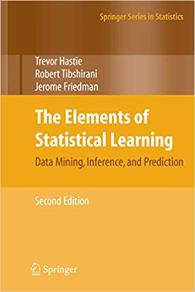

# ESL

This repo contains studying notes and my thoughts on the book [_Elements of Statistical Learning, Data Mining, Inference, and Prediction (2nd Ed)_](https://web.stanford.edu/~hastie/ElemStatLearn/) by Trevor Hastie, Robert Tibshirani, and Jerome Friedman. It is my all time favorite text book on statistical learning (or other people may call it machine learning). I always recommend it to friends who ask me for "the best statistical textbook". I read this book from time to time to stay sharp about the fundamentals of statistical learning and whenever I am uncertain a specific learning method. My intention for this repo is for me to first summarize the important messages delivered by the book and to also incorporate some of my thoughts and experience using them. It is an ongoing project of my own that I work on in my spare time. 

